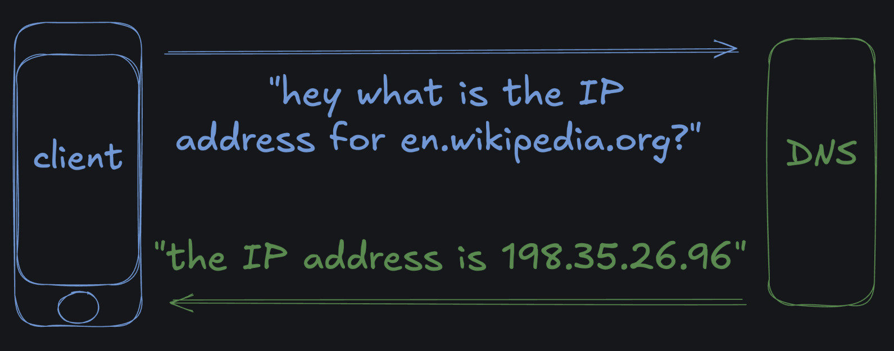

###### 
 WmcUebung-007 

# *DNS = "Domain Name System"*
  - DNS is kind of the *phonebook of the internet*.    
  - DNS "resolves" domain names, like [`google.com`](http://www.google.com) to their associated IP addresses so that web clients can find the server they're looking for.

  
  

---
